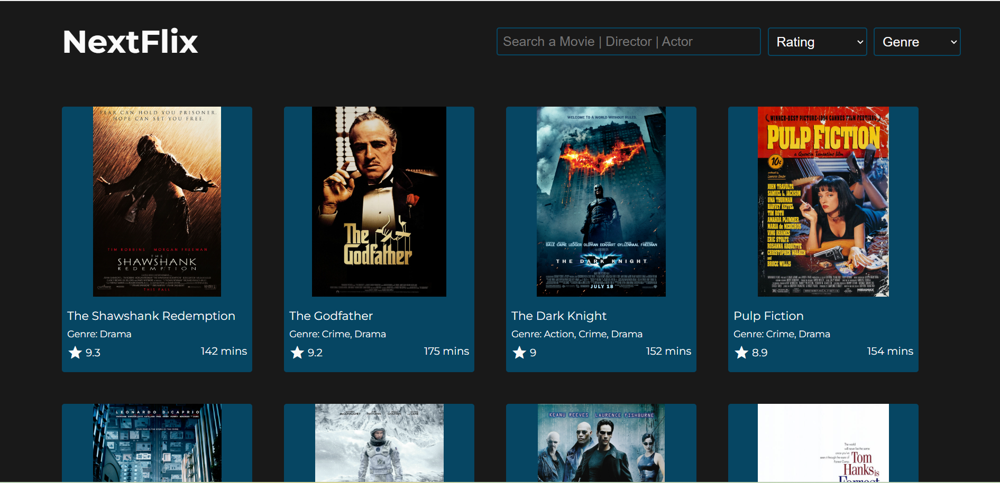

<p align="center">
  <a href="https://shreyansh0843.github.io/NextFlix/">
    
  </a>
</p>
<h1 align="center">
  NextFlix - Movie Discovery Platform
</h1>


## Overview
CineScope is a dynamic movie discovery web application built with vanilla JavaScript that allows users to explore, search, and filter through a curated collection of films. The platform offers an intuitive interface for movie enthusiasts to find films based on ratings, genres, and custom search criteria.

## Features
- **Advanced Search Functionality**: Search movies by title, director, writer, or cast members
- **Real-time Filtering**: Dynamic filters for:
  - IMDB ratings (7+, 8+, 8.5+, 9+)
  - Multiple genres
- **Responsive Movie Cards**: Each card displays:
  - Movie poster
  - Title
  - Genre
  - IMDB rating
  - Duration
- **Optimized Performance**: Implements debouncing for search functionality
- **Clean UI/UX**: Minimalist design with smooth transitions and hover effects

## Technical Details
- **Frontend**: HTML5, CSS3, Vanilla JavaScript
- **Styling**: Custom CSS with responsive design
- **External Libraries**: 
  - Axios for API handling
  - Material Icons for UI elements
- **Performance**: Optimized with debouncing and efficient DOM manipulation

## Development Features
- Modular JavaScript code structure
- Efficient state management
- Responsive design principles
- Cross-browser compatibility
- Clean and maintainable codebase

## Getting Started
1. Clone the repository
```bash
git clone https://github.com/yourusername/cinescope.git
